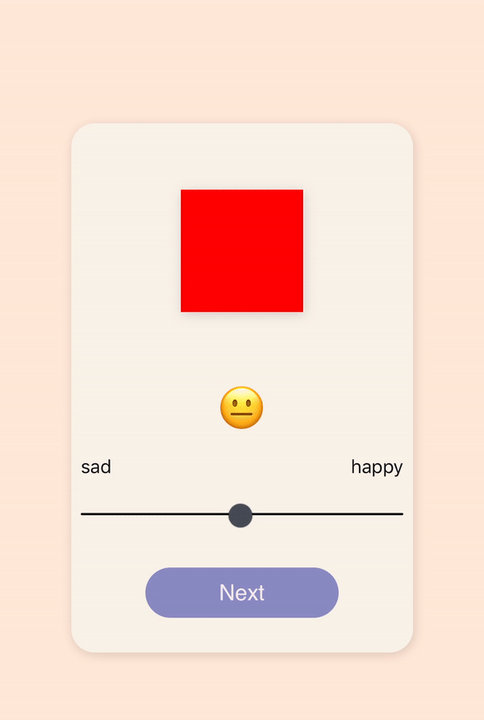
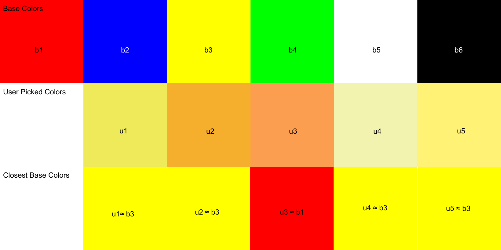

# Color Therapy

---
## Introduction
Color Therapy was born out of a love for playlist applications. We generate accurate playlists based on emotions and colors, since good music is always a captivating mood-booster.

## Using Spotify's API
We decided to use Spotify's [Get Recommendations Based on Seeds](https://developer.spotify.com/documentation/web-api/reference/browse/get-recommendations/) endpoint to search for tracks. Seeds are a combination of up to 5 artists, tracks, or genres. We use the user's top artists as Seeds, since artists are highly indicative of music taste, and artists can span multiple genres. 

The recommendations endpoint also takes "tuneable track attributes" as query parameters. This means we can search with filters such as acousticness, danceability, and tempo. The two most interesting track attributes are "energy" and "valence". Energy in this context is measured by perceptual intensity, which includes dynamic range, perceived loudness, timbre, onset rate, and general entropy. Valence is measured by musical positiveness; tracks with high valence sound more positive (e.g. happy, cheerful, euphoric), while tracks with low valence sound more negative (e.g. sad, depressed, angry).

With this endpoint in mind, we devised a way to calculate energy and valence using colors.

## Understanding valence and color
With Color Therapy, the user will be picking colors. However, colors themselves are very subjective - they have no meaning without context. There are some generalizations (red is angry, blue is sad, etc), however one of our goals was to make the generated playlists personal. 



The purpose of the color quiz is to make sense of how the user sees color. The user is asked to rank various colors from sad to happy, internally stored as a value between `0.0` and `1.0`. This value will be the **individual** valence for each "base color" in the quiz. The base colors are as follows:
- `#FF0000 red` 
- `#0000FF blue` 
- `#FFFF00 yellow` 
- `#00FF00 green`
- `#FFFFFF white`
- `#000000 black`

These base colors were deliberately chosen to cover the RGB color model, primary colors, and black/white. The intention here is to have the widest color range possible. 

Assigning valence values to base colors gives our colors context, so now we can calculate the **closest** base color to any random color.

> Obtaining the previously mentioned attribute "energy" is straightforward. The first slider of the quiz asks the user about their energy level, and we pass that value directly into Spotify's query parameters.


## Calculating color difference and target valence

We started by calculating the [color difference](https://en.wikipedia.org/wiki/Color_difference) between one chosen color and one base color. Since we are using RGB values, we calculated the [Euclidean distance](https://en.wikipedia.org/wiki/Euclidean_distance) between the two colors to find their difference. However, after doing some research we realized that Euclidean distance may not produce the most accurate results for our use case since RGB is not "perceptually uniform". In other words, using Euclidean distance makes sense for a screen, not for our eyes. We want to relate a chosen color to its **perceptually closest base color**. For this, we need to use [Delta E](http://www.colorwiki.com/wiki/Delta_E:_The_Color_Difference), which calculates **perceived** color difference.

| Delta E | Perception                             |
|:-------:|----------------------------------------|
|  <= 1.0 | Not perceptible by human eyes.         |
|  1 - 2  | Perceptible through close observation. |
|  2 - 10 | Perceptible at a glance.               |
| 11 - 49 | Colors are more similar than opposite  |
| 100     | Colors are exact opposite              |

> source: http://zschuessler.github.io/DeltaE/learn/

We extended this idea of color difference to multiple colors, and were able to calculate an average/target valence value from a collection of user picked colors. The following is an example:



Remember that each "base color" has its own valence value (from the color quiz). The closest "base color" for the user picked colors `u1`, `u2`, `u4`, and `u5` is `b3`, yellow. However, the closest "base color" for `u3` is `b1`, red. This is because the **delta e** of `u3` and `b1` was the smaller compared to `b3`, and compared to the rest of the base colors. The distinction here is important since we care about **perceived** color difference.

For the above example we can calculate valence like so:

```
targetValence = (getValence(b3) * 4 + getValence(b1)) / 5
```

A more general formula for valence would look like this:

)


We've successfully calculated valence! This value represents the users emotions, and picked colors. Now that we have valence, energy, and Seed artists, we can make a `GET` request to Spotify's endpoint. The request will return personalized tracks, which we use to create a new playlist.

One highlight is the playlist image art will actually be the colors the user selected.

![colorHeader](data:image/jpeg;base64,/9j/4AAQSkZJRgABAQAAAQABAAD/2wBDAAMCAgICAgMCAgIDAwMDBAYEBAQEBAgGBgUGCQgKCgkICQkKDA8MCgsOCwkJDRENDg8QEBEQCgwSExIQEw8QEBD/2wBDAQMDAwQDBAgEBAgQCwkLEBAQEBAQEBAQEBAQEBAQEBAQEBAQEBAQEBAQEBAQEBAQEBAQEBAQEBAQEBAQEBAQEBD/wAARCAEsASwDASIAAhEBAxEB/8QAFwABAQEBAAAAAAAAAAAAAAAAAAUEB//EABoQAQACAwEAAAAAAAAAAAAAAAAV4WNkoqP/xAAYAQEBAQEBAAAAAAAAAAAAAAAABQYHBP/EACURAQAAAwYHAQAAAAAAAAAAAAABFaEEFlKi0eECAwUUU2Jj0v/aAAwDAQACEQMRAD8AugO4LoAAAAAAAAAAAAAAAAAAAAAAAAAAAAAAAAAAAAAAAAAAAAAAAAAAAAAAAAAAAAAAAAAAAAAAAAAAAAAAAAAAAAAAAAAAAAAAAAAAAAAAAAAAAAAAAAN0bm5sjc3NvL3vIxUilzuw46R0YRujc3Nkbm5s73kYqRJ3YcdI6MI3RubmyNzc2d7yMVIk7sOOkdGEbo3NzZG5ubO95GKkSd2HHSOjCN0bm5sjc3Nne8jFSJO7DjpHRhG6Nzc2RubmzveRipEndhx0jowjdG5ubI3NzZ3vIxUiTuw46R0YRujc3Nkbm5s73kYqRJ3YcdI6MI3RubmyNzc2d7yMVIk7sOOkdGEbo3NzZG5ubO95GKkSd2HHSOjCN0bm5sjc3Nne8jFSJO7DjpHRhG6Nzc2RubmzveRipEndhx0jowjdG5ubI3NzZ3vIxUiTuw46R0YRujc3Nkbm5s73kYqRJ3YcdI6MI3RubmyNzc2d7yMVIk7sOOkdGEbo3NzZG5ubO95GKkSd2HHSOjCN0bm5sjc3Nne8jFSJO7DjpHRhG6Nzc2RubmzveRipEndhx0jowjdG5ubI3NzZ3vIxUiTuw46R0bQEFgQAAAAAAAAAAAAAAAAAAAAAAAAAAAAAAAAAAAAAAAAAAAAAAAAAAAAAAAAAAAAAAAAAAAAAAAAAAAAAAAAAAAAAAAAAAAAAAAAAAAAAAAAAAAAAAAAdIFGX+1N2XvJ8s2zm46QEv9qbl5Plm2c3HSAl/tTcvJ8s2zm46QEv9qbl5Plm2c3HSAl/tTcvJ8s2zm46QEv9qbl5Plm2c3HSAl/tTcvJ8s2zm46QEv8Aam5eT5ZtnNx0gJf7U3LyfLNs5uOkBL/am5eT5ZtnNx0gJf7U3LyfLNs5uOkBL/am5eT5ZtnNx0gJf7U3LyfLNs5uOkBL/am5eT5ZtnNx0gJf7U3LyfLNs5uOkBL/AGpuXk+WbZzcdICX+1Ny8nyzbObjpAS/2puXk+WbZzcdICX+1Ny8nyzbACky4AAAAAAAAAAAAAAAAAAAAAAAAAAAAAAAAAAAAAAAAAAAAAAAAAAAAAAAAAAAAAAAAAAAAAAAAAAAAAAAAAAAAAAAAAAAAAAAAAAAAAAAAAAAAAAACvAbfnZAbfnasMjNLXjpDR2y6PRvDm4/0kwG352QG352rBNLXjpDQuj0bw5uP9JMBt+dkBt+dqwTS146Q0Lo9G8Obj/STAbfnZAbfnasE0teOkNC6PRvDm4/0kwG352QG352rBNLXjpDQuj0bw5uP9JMBt+dkBt+dqwTS146Q0Lo9G8Obj/STAbfnZAbfnasE0teOkNC6PRvDm4/0kwG352QG352rBNLXjpDQuj0bw5uP9JMBt+dkBt+dqwTS146Q0Lo9G8Obj/STAbfnZAbfnasE0teOkNC6PRvDm4/0kwG352QG352rBNLXjpDQuj0bw5uP9JMBt+dkBt+dqwTS146Q0Lo9G8Obj/STAbfnZAbfnasE0teOkNC6PRvDm4/0kwG352QG352rBNLXjpDQuj0bw5uP9JMBt+dkBt+dqwTS146Q0Lo9G8Obj/STAbfnZAbfnasE0teOkNC6PRvDm4/0kwG352QG352rBNLXjpDQuj0bw5uP9JMBt+dkBt+dqwTS146Q0Lo9G8Obj/STAbfnZAbfnasE0teOkNC6PRvDm4/0AJ7SAAAAAAAAAAAAAAAAAAAAAAAAAAAAAAAAAAAAAAAAAAAAAAAAAAAAAAAAAAAAAAAAAAAAAAAAAAAAAAAAAAAAAAAAAAAAAAAAAAAAAAAAAAAAAAAAO5gMkjgAAAAAAAAAAAAAAAAAAAAAAAAAAAAAAAAAAAAAAAAAAAAAAAAAAAAAAAAAAAAAAAAAAAAAAAAAAAAAAAAAAAAAAAAAAAAAAAAAAAAAAAAAAAAAAAAAAAAAAAAAAAAAAAAAAAAAAAAAAAAAAAAAAAAAP/Z)

Accomplishing this involved creating an invisible `HTML` canvas element, and individually coloring its pixels with RGB values from the chosen colors. Then, converting the image to a `base64` encoded string to make a `PUT` request to Spotify. [There's more details in the code.](https://github.com/kabirvirji/colortherapy/blob/master/src/components/ColorPicker/ColorPicker.js#L81)

Additionally, the UI for Color Therapy is reminiscent of the [old Friv Games](https://github.com/kabirvirji/colortherapy/blob/master/src/images/oldfriv.png), but with [randomly generated colors](https://github.com/kabirvirji/colortherapy/blob/master/src/components/ColorPicker/ColorPicker.js#L31) and [infinite scrolling](https://github.com/kabirvirji/colortherapy/blob/master/src/components/ColorPicker/ColorPicker.js#L69) 😊

## Final thoughts

Moving forward, it would be interesting for the quiz to include more questions, and for the user to pick more colors. This would increase valence accuracy, resulting in more accurate playlists. Additionally, if we added a backend we could generate unique data about the relationships between music, color, and valence.

Despite the relationship between music and color being subjective, we hope people can connect with the playlists generated! Thank you for reading, if you enjoyed [Color Therapy](https://colortherapy.io/) please star our repo and share with your friends!

---
## More playlist applications to check out

- [spoticlean](https://github.com/kabirvirji/spoticlean): mass delete playlists using RegEx (helpful for developing playlist apps)
- [singlespotify](https://github.com/kabirvirji/singlespotify): create a playlist based on a single artist
- [spotifork](https://github.com/kabirvirji/spoticlean): fork a Spotify playlist
 